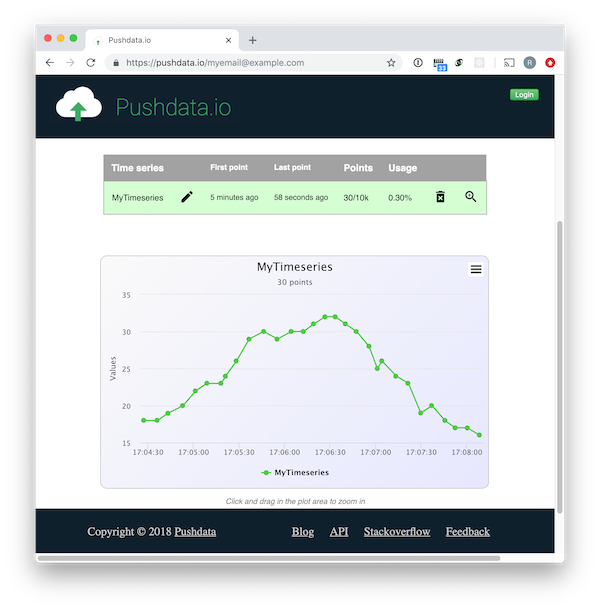

# Pushdata Python client library

This library allows you to easily store and retrieve time series data using the online service [pushdata.io](https://pushdata.io).

## Installation

`pip install pushdata-io`

## Getting started

You can start storing data on [pushdata.io](https://pushdata.io) _immediately_, without even registering an account there. Just install this package and write three lines of code, like this:

```python
import pushdata

pd = pushdata.Client(email="youremail@yourdomain.com", tsname="MyTimeseries")
pd.send(12345)  # Stores the data point 12345, timestamped with the current date and time
```

After you've run the code and stored at least one data point, go to __https://pushdata.io/youremail@yourdomain.com__ where you will be able to view your timeseries. Here is a screenshot:

<p align="center"></p>

## Usage

```python
import pushdata

# 1. Initialize with no authentication
# Initialize with our account email and time series name we want to use
pd = pushdata.Client(email="myemail@example.com", tsname="mytimeseries")

# 2. ...or initialize with authentication (for account with security=on)
pd = pushdata.Client(apikey="thd8JT73LsB8jah0F4d9", tsname="mytimeseries")

# Send a data point to the time series
pd.send(4711)

# Send to another time series by overriding tsname
pd.send(4711, tsname="myothertimeseries")

# Retrieve all data from the time series
response = pd.recv()

# Or from another time series
response = pd.recv(tsname="anothertimeseries")

# Retrieve data timestamped during the last week
import datetime
one_week_ago = datetime.datetime.now() - datetime.timedelta(days=7)
response = pd.recv(fromtime=one_week_ago)

# Retrieve data for one 24-hour period, one week ago
import datetime
one_week_ago = datetime.datetime.now() - datetime.timedelta(days=7)
one_week_ago_plus_24h = one_week_ago + datetime.timedelta(days=1)
response = pd.recv(fromtime=one_week_ago, totime=one_week_ago_plus_24h)

#
# Print time series data
#
# We get a Python Requests response object from recv(), which 
# includes response code, raw HTTP response body, and more.
# We use the .json() method to parse the body text as JSON
# and get a dictionary:
tsdata = response.json()
#
# And then we print stuff:
print("Timeseries name: " + tsdata["name"])
print("First point recorded at   : " + tsdata["first"])    # timestamp of first point in time series
print("Last point recorded at    : " + tsdata["last"])     # timestamp of last point in time series
print("Total number of points    : " + tsdata["total"])    # total number of points in timeseries
print("Number of points returned : " + tsdata["returned"]) # number of points returned in this call
print("---- Points ----")
for point in tsdata["points"]:
    print("Time=%s value=%f" % (point["time"], point["value"]))

#
# tsdata (the decoded JSON response from pushdata.io) is 
# a dictionary that looks like this:
#  {
#     "name": "mytimeseries",
#     "first": "2019-02-15T07:43:31.546805Z",
#     "last": "2019-03-05T11:21:06.20951Z",
#     "total": 482,
#     "returned: 482,
#     "offset": 0,
#     "limit": 10000,
#     "points": [
#        {
#           "time": "2019-02-15T07:43:31.546805Z",
#           "value": 4711.0
#        },
#        ...
#     ]
#  }
#
# See https://speca.io/ragnarlonn/pushdata-io#TimeSeriesData
#
```

